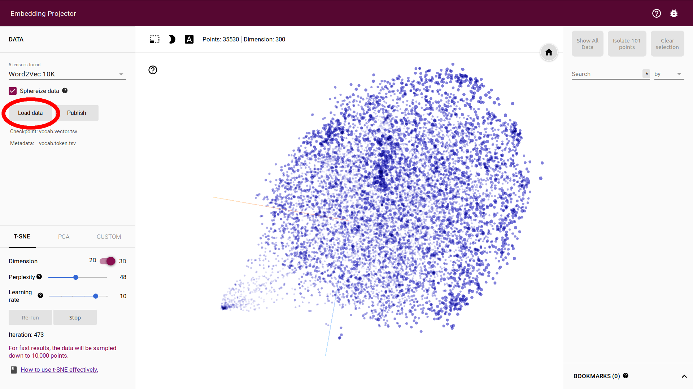
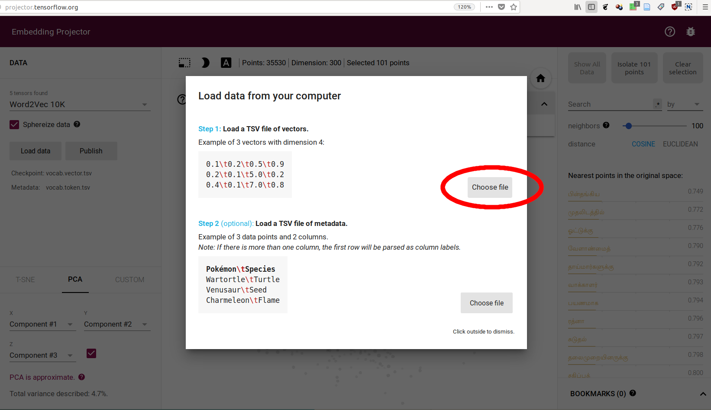
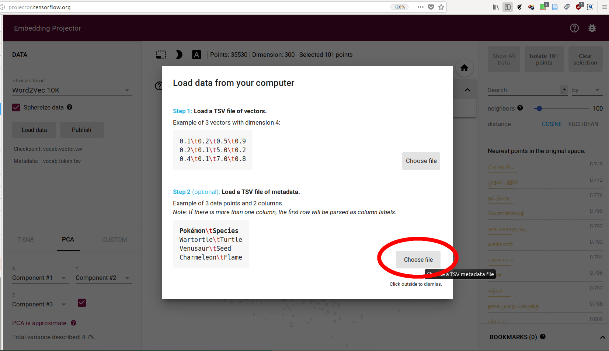
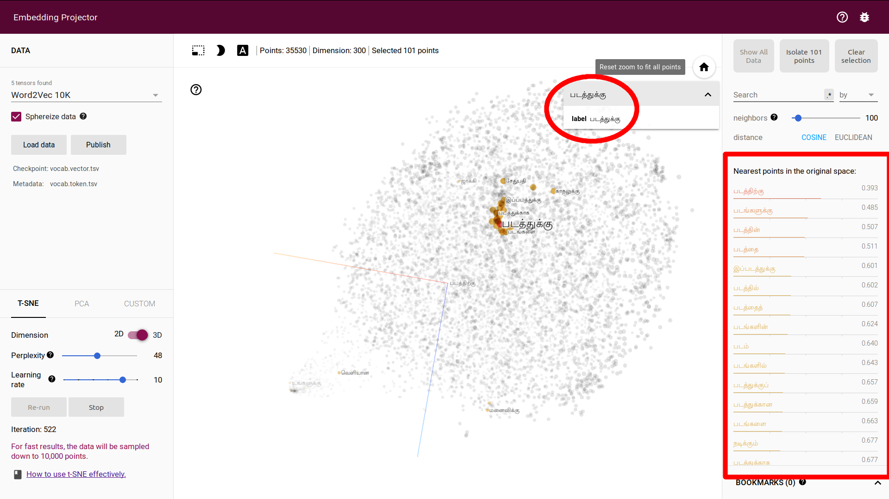
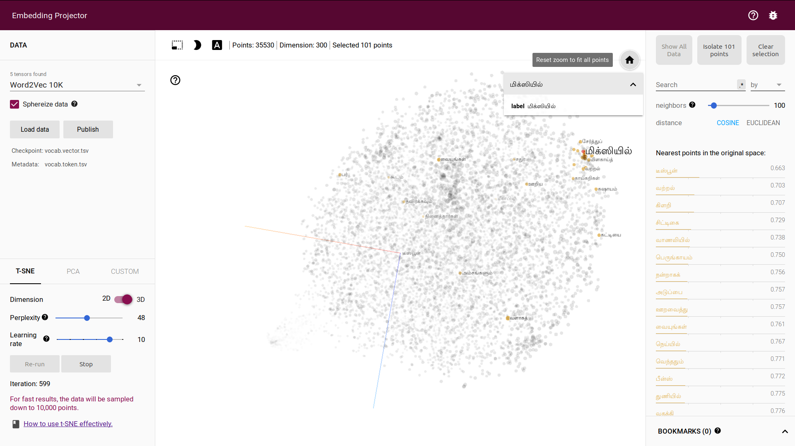
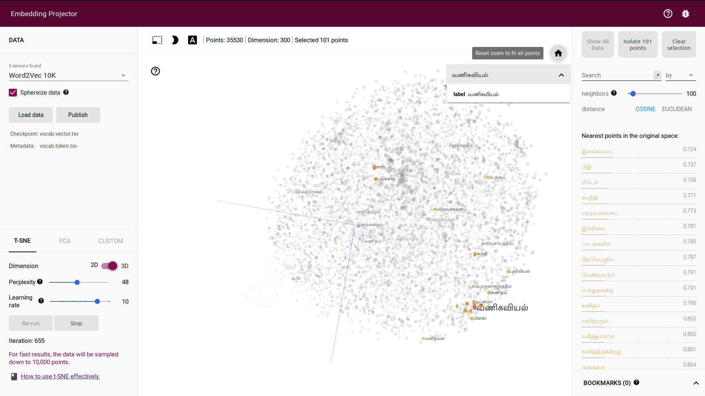
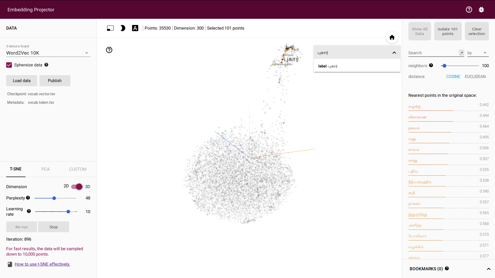

# தமிழ் மொழி ஒப்பு - tamil-lm
மொழியொப்பேற்றம், வெறும் செய்திதாள் கட்டுரைகளிலிருந்து, கணினி எப்படி சொற்களுக்கு இருக்கும் தொடர்பை கண்டுபிடிக்கிறது.

Language modelling based on skip-grams over tamil news dataset

## [காட்சிப்பொருள் - Demo](http://w2v.kaatchi.cheyyarivu.org/)
இந்த தளத்தில் சென்று தொடர்புடைய சொற்கள் எவையவை, தொடர்பில்லாத சொற்கள் எவையவை என்று கணியொப்பே கண்டறிந்து காட்டுவதைப்பார்கலாம்.

Please go to the [link](http://w2v.kaatchi.cheyyarivu.org/) for the demo.

## தரவுக்கணம் - Dataset
செய்திதாள் கட்டுரைளை படியெடுத்து, கொஞ்சம் சுத்தஞ்செய்து ஆக்கப்பட்ட தரவுக்கணம் ஒன்று விரைவில் வெளியிடப்படும். சுத்தஞ்செய்யும் முறைகளும், விளக்கப்படும்.
The data is scraped from tamil news websites. The dataset will be made available soon. 

## ஒப்புகள் - Models
இச்சட்டியில், மொத்தம் மூன்று ஒப்புகள் உள்ளன, எனினும், skipgram நன்கு செயல்படுகிறது. 
Though there are three models available in the repo, skipgram works well.

## Model weights.
### Plain text vocabulary and embedding vectors
The embedding vectors and corresponding tokens can be downloaded from [vaaku2vec.zip](https://drive.google.com/open?id=1G3FM2paj9JaX-zsg0yDWxAHGrlxnjROy)

#### How to visualize?
You can upload the vocab.vectors.tsv and vocab.tokens.tsv in [TensorFlow Projector](https://projector.tensorflow.org) to visualize them. 

 
 
 

Use TSNE projection and let it run for more than 400 iterations. You can see the cone-ice shape come to life. It is really fun. 
 
| |  |
| |  |

## Training
    $ python main.py train
    
## Sister Projects
[Malayalam - Vaaku2Vec](https://github.com/adamshamsudeen/Vaaku2Vec/)

## Thanks
- [Abin Simon](https://github.com/meain) for setting up the UI.
- [Adam Shamshudeen](https://github.com/adamshamsudeen) for setting up the server side.
- [Malaikannan Sankarasubbu](https://github.com/malaikannan) For letting me work on this full time.
- [Sebastian Ruder](https://github.com/sebastianruder) For helping me learn word embeddings years ago.

And all the good people who write blogs everyday to better the humanity.
